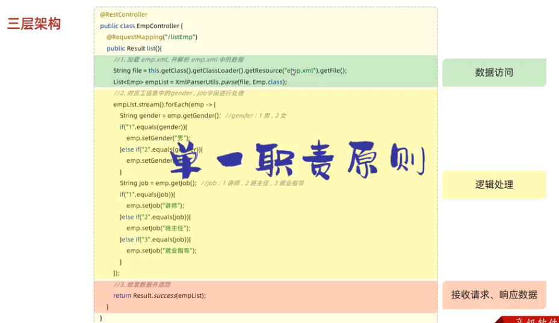
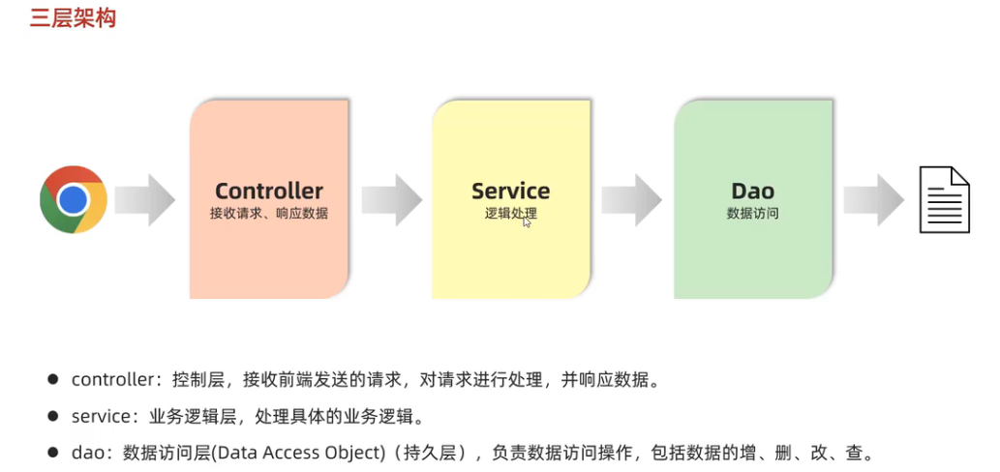
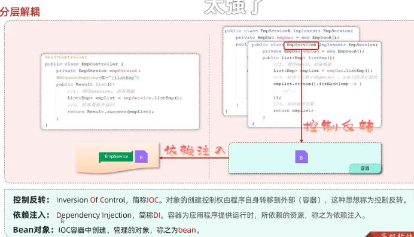
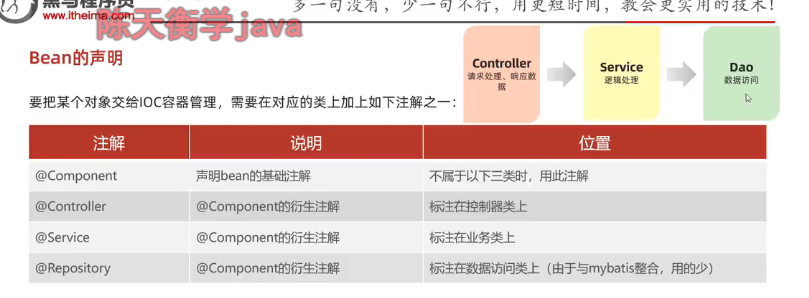
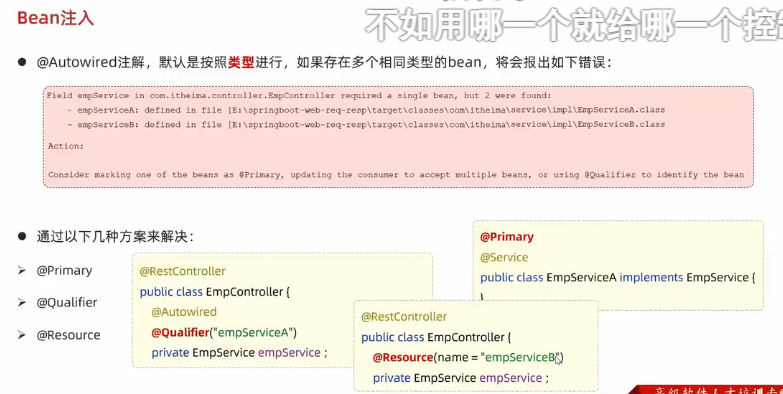

### 响应状态码

### starter 起步依赖

### Tomcat web容器 servlet容器 
httpServletRequest 获取请求数据
dispatcherServlet 前端控制器
httpServletResponse 获取响应数据

### Postman

### 数组结合参数请求

### 响应数据

### 分层解耦

### 控制反转和依赖注入 是为了层与层之间的解耦

